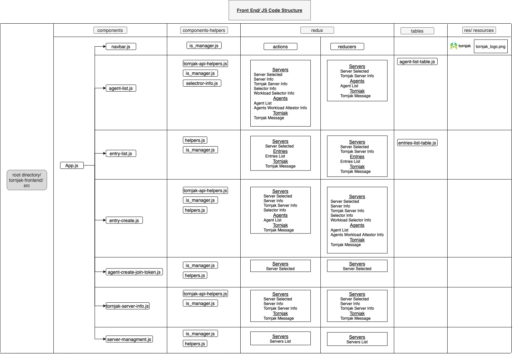
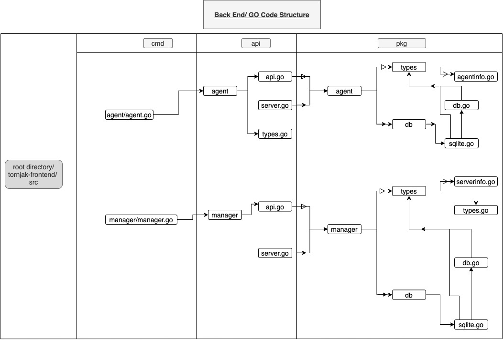
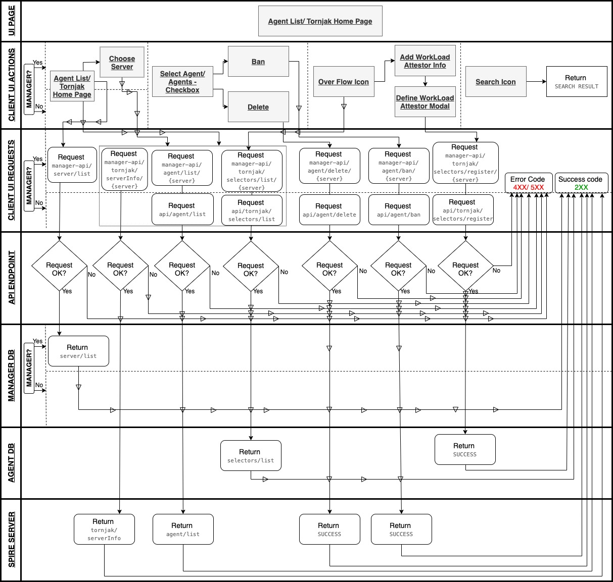
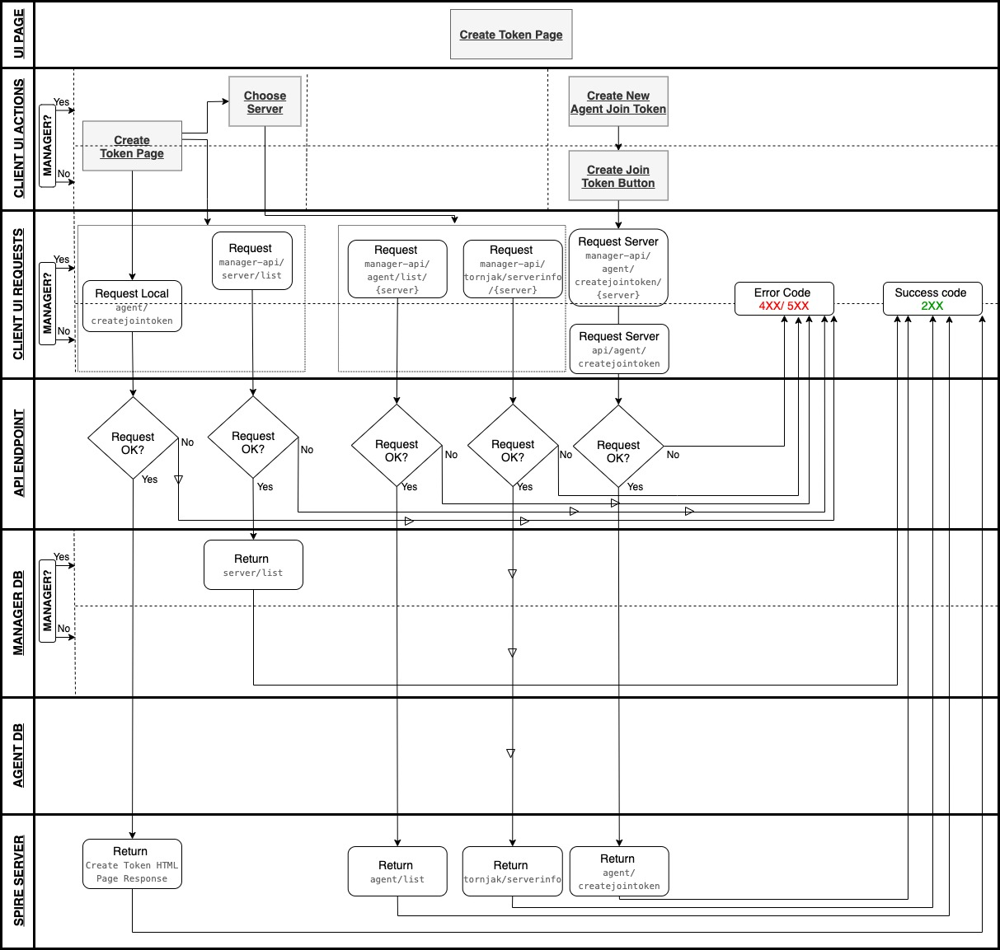
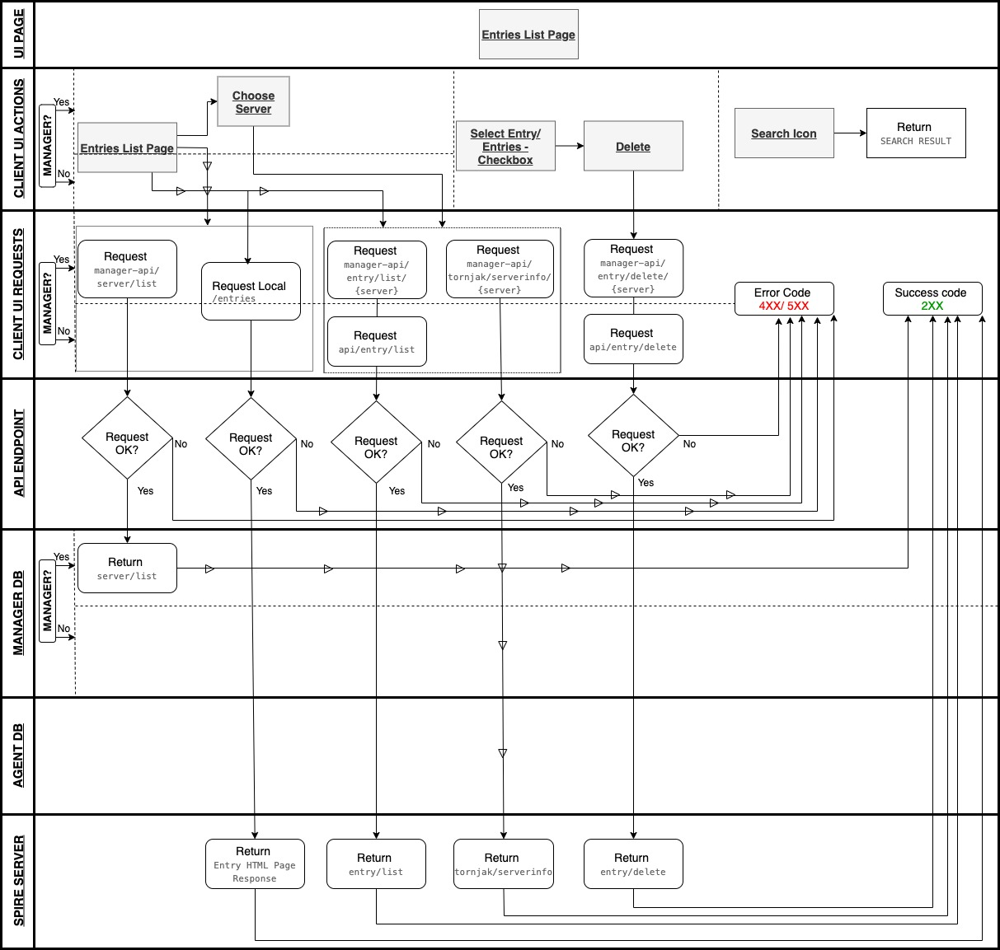
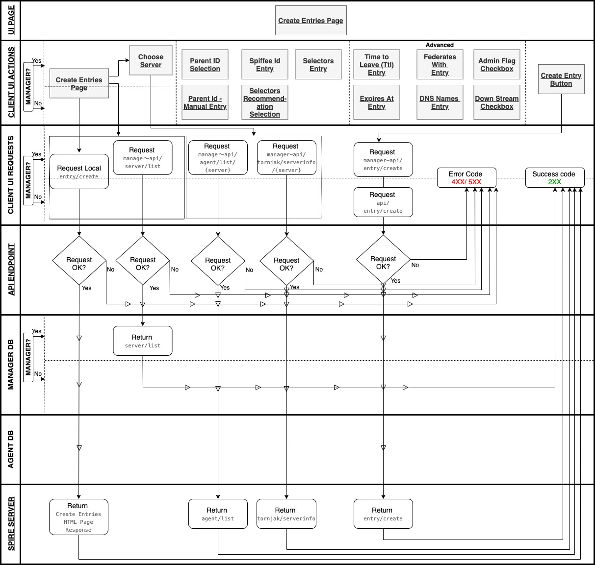
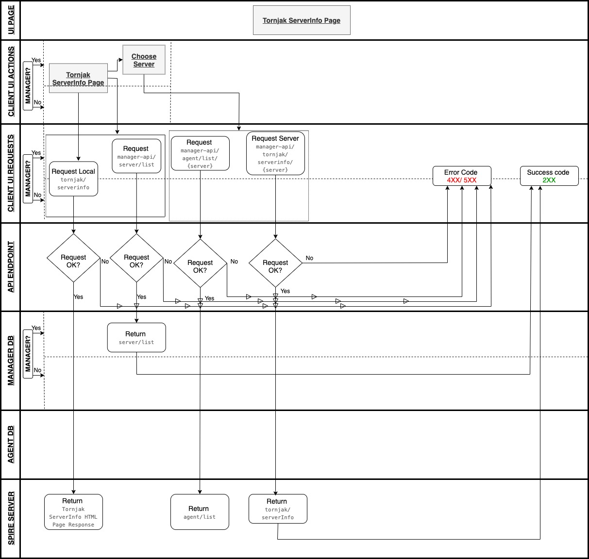
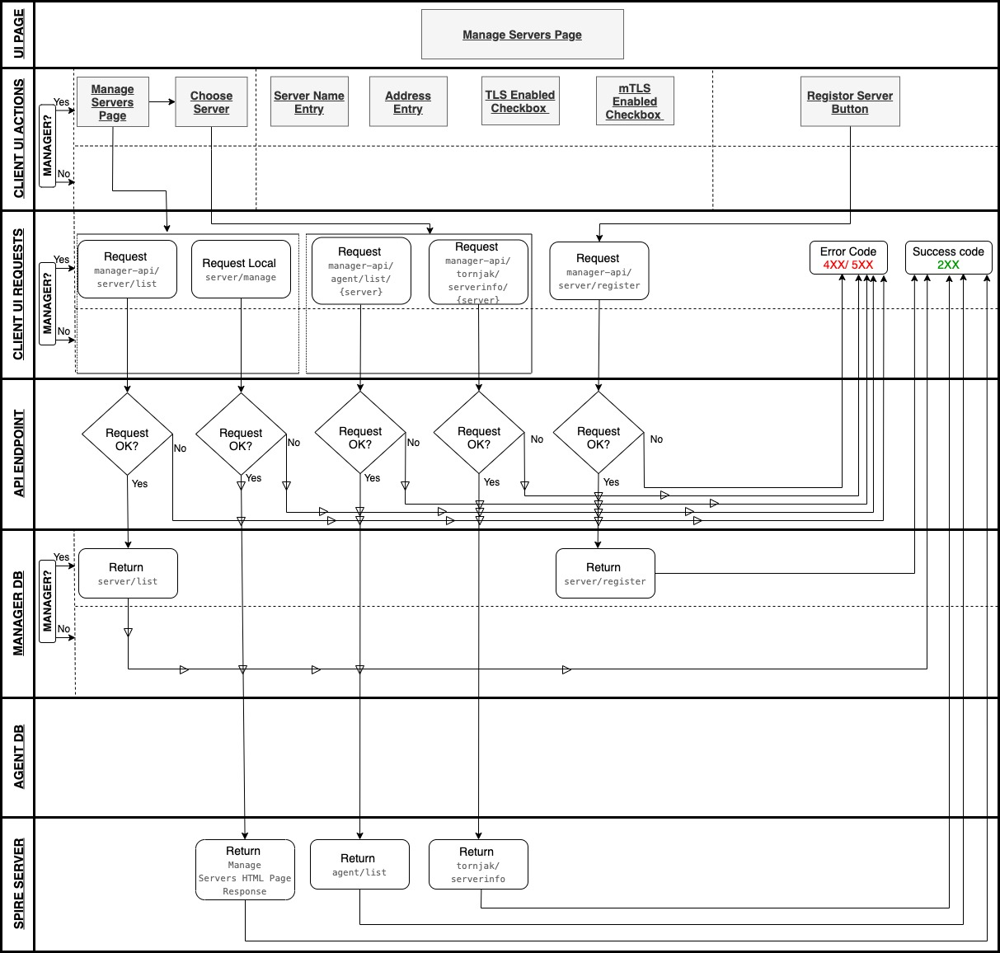

# Tornjak UI-API Documentation

Overview
This documentation details tornjak’s user interface and its interaction with the APIs and the redux state management. 



# Tornjak User Interface (UI) Architecture

UI Pages (With their paths)
Below are UI pages of Tornjak with their respective paths. For details on a specific UI component and it’s interaction with the API calls refer to the diagrams respective to the pages by clicking on the link “Details”. There are two seperate UI’s, the manager UI and the regular agent UI. The regular agent UI is utilized for configuration and management of identities (For details visit Agent design details). The manager UI  in addition to the regular agent UI includes the manager management panel/ page used to manage SPIRE servers (For details visit Manager design details).  
* Tornjak Home Page (/)
  - Details
* Agents Page (/agents || /agent/*)
  - Agents List Page  (/agents) 
    - Details
  - Create Token Page  (/agent/createjointoken) 
    - Details
* Entries Page (/entries || /entry/*) 
  - Entries List Page  (/entries) 
    - Details
  - Create Entries Page  (/entry/create) 
    - Details
* Tornjak ServerInfo Page (/tornjak/serverinfo)
  - Details
* Manage Servers Page (/server/manage) [ONLY FOR MANAGER UI]
  - Details

# Tornjak User Interface (UI) Interaction with API Endpoints
## * Agent API’s
Get
- Agents
### /api/agent/list
```
Request 
api/agent/list

Example response:
HTTP/1.1 200 OK
Content-Type: application/json; charset=utf-8

{
  "agents": [
    {
        "id": {
    "trust_domain": "example.org",
    "path": "/spire/agent"
},
"attestation_type": "k8s_sat",
 "x509svid_serial_number": "111",
 "x509svid_expires_at": 222,
 "selectors": [
      {
           "type": "k8s_sat",
              "value": "agent_ns:spire"
       },
       {
              "type": "k8s_sat",
              "value": "agent_sa:spire-agent"
       },
  ]
        }
}

```
- Entries
### /api/entry/list
```
Request 
api/entry/list
Example response:
HTTP/1.1 200 OK
Content-Type: application/json; charset=utf-8

{
  "entries": [
    {
        "id": "id1",
"spiffe_id": {
    "trust_domain": "example.org",
    "path": "/spire/agent/"
},
"parent_id": {
     "trust_domain": "example.org",
       "path": "/spire/agent/"
},
 "selectors": [
      {
           "type": "k8s_sat",
              "value": "agent_ns:spire"
       },
       {
              "type": "k8s_sat",
              "value": "agent_sa:spire-agent"
       },
  ]
        }
}

```
- Tornjak Specific
### /api/tornjak/serverinfo
```
Request 
api/tornjak/serverinfo
Example Response:
HTTP/1.1 200 OK
Content-Type: application/json; charset=utf-8

{
  "plugins": {
"DataStore": [
          "sql",
],
  "KeyManager": [
          "disk",
],
  "NodeAttestor": [
          "k8s_sat",
],
  "NodeResolver": [
          "k8sbundle",
],

  "trust_domain": "example.ord",
  "verboseConfig": "Plugin Info……..."

}

```
### /api/tornjak/selectors/list
```
Request 
api/tornjak/
selectors/list
Example response:
HTTP/1.1 200 OK
Content-Type: application/json; charset=utf-8

{
  "agents": {
    "spiffeid": "spiffe://example.org/spire/agent/",
    "plugin": "plugin1"
  }
}

```
POST
- Agents
### /api/agent/ban
```
Request 
api/agent/ban
Example request payload:
HTTP/1.1 200 OK
Content-Type: application/json; charset=utf-8

{
  "id": {
    "path": "/spire/agent/",
    "trust_domain": "example.org"
  }
}
Example response:
SUCCESS
```
### /api/agent/delete
```
Request 
api/agent/delete
Example request payload:
HTTP/1.1 200 OK
Content-Type: application/json; charset=utf-8

{
  "id": {
    "path": "/spire/agent/",
    "trust_domain": "example.org"
  }
}
Example response:
SUCCESS
```
### /api/agent/createjointoken
- Entries
### /api/entry/create
```
Request 
api/entry/create
Example request payload:
HTTP/1.1 200 OK
Content-Type: application/json; charset=utf-8

{
  "admin": "/spire/agent/",
  "dns_names": "/spire/agent/",
  "downstream": "/spire/agent/",
  "expires_at": "/spire/agent/",
  "federates_with": [],
  "parent_id": {
     "trust_domain": "example.org",
       "path": "/spire/agent/"
  },
  "selectors": [
     {
       "type": "k8s_sat",
       "value": "agent_ns:spire"
     },
     {
       "type": "k8s_sat",
       "value": "agent_sa:spire-agent"
     },
]


  "spiffe_id": {
    "trust_domain": "example.org",
    "path": "/spire/agent/"
},

}
Example response:
{
  "results": [
    {
        "status": {
"message":"OK"
}
      "entry": {
"message":"OK"
}
"spiffe_id": {
    "trust_domain": "example.org",
    "path": "/spire/agent/"
},
"parent_id": {
     "trust_domain": "example.org",
       "path": "/spire/agent/"
},
 "selectors": [
      {
           "type": "k8s_sat",
              "value": "agent_ns:spire"
       },
       {
              "type": "k8s_sat",
              "value": "agent_sa:spire-agent"
       },
  ]
        }
}
```
### /api/entry/delete
```
Request 
api/entry/delete
Example request payload:
HTTP/1.1 200 OK
Content-Type: application/json; charset=utf-8

{
  "ids": [
    "111",
  ]
}
Example response:
{
     "Results": [
    {
           "status": 
             {"messege":  "OK"},
                 "id":  "111"
}                
  ]}
```
- Tornjak Specific
### /api/tornjak/selectors/register
```
Request 
api/tornjak/selectors/register
Example request payload:
HTTP/1.1 200 OK
Content-Type: application/json; charset=utf-8

{
  "id": {
    "plugin": "plugin1",
    "spiffee id": "spiffe://example.org/spire/agent"
  }
}
Example response:
SUCCESS
```

## * Manager API’s
All of Tornjak agent APIs apply for manager APIs as well except that manager APIs are proxy calls of agent APIs (/manager-api/). In addition to the agent APIs manager API also includes server’s APIs as described below. 

GET
- Servers
### /manager-api/server/list
```
Request 
manager-api/server/list
Example response:
{
"servers": 
[
{
                "name": "server1",
                "address": "http://localhost:10000/",
"tls": false,
                "mtls": false
}
]
}
```
POST
- Servers
### /manager-api/server/register
```
Request 
manager-api/server/register
Example request payload:
HTTP/1.1 200 OK
Content-Type: application/json; charset=utf-8

{
"name": "server1",
"address": "http://localhost:10000/",
"tls": false,
"mtls": false,
"ca": null,
"cert": null,
"key": null

}
Example response:
SUCCESS
```

Figure 1. Agent List/ Home Page UI-API Interactions

Figure 2. Create Token Page UI-API Interactions

Figure 3. Entries List Page UI-API Interactions

Figure 4. Create Entries Page UI-API Interactions

Figure 5. Tornjak ServerInfo Page UI-API Interactions

Figure 6. Manage Servers Page UI-API Interactions [ONLY FOR MANAGER UI]

# Tornjak Redux Reducers and Actions With Their Respective Descriptions

Redux reducers are functions that mutate the current state based upon the defined action and generally as a developer one should be interfacing with the actions as those actions define the events that describe how and when the state is mutating in the application. One should only be creating reducers if modifying the data model is necessary. 

## * [Reducers] (https://github.com/lumjjb/tornjak/tree/main/tornjak-frontend/src/redux/reducers)
- Servers
  * Server Selected
    - Stores the selected server in the redux state
  * Server Info
    - Stores the torjak server info of the selected server in the redux store
  * Tornjak Server Info
    - Stores the tornjak server info of the selected server in the redux store
  * Servers List
    - Stores the list of available servers and their basic info in the redux store
  * Selector Info
    - Stores the list of available selectors and their options in the redux store
  * Workload Selector Info
    - Stores the list of available workload selectors and their options in the redux store

- Agents
  * Agent List
    - Stores the list of agents with their info in the redux store
  * Agents Workload Attestor Info 
    - Stores the workload selector info for the agents in the redux store

- Entries
  * Entries List
    - Stores the list of entries with their info in the redux store

- Tornjak
  * Tornjak Message
    - Stores the Error Message/ Success Message of an executed function in the redux store

## * [Actions] (https://github.com/lumjjb/tornjak/tree/main/tornjak-frontend/src/redux/actions)
- TornjakMessage
  * Expected input - "Error Message/ Success Message"                                                                                    
  * This action returns the Error Message/ Success Message of an executed function
- ServerSelected
  * Expected input - "ServerName"
  * This action returns the server selected in the redux state
- TornjakServerInfoUpdate
  * Expected input - "TornjakServerInfo" struct (as JSON) based on TornjakServerInfo in /api/types.go
  * This action returns the tornjak server info of the selected server
- ServerInfoUpdate
  * Expected input -
    ```
    {
          "data": 
          {
            "trustDomain": trustDomain,
            "nodeAttestorPlugin": nodeAttestorPlugin
          }
    }
    ```
  * This action returns the server trust domain and nodeAttestorPlugin
- ServersListUpdate
  * Expected input - 
    ```
     [
          "server1": 
          {
            "name": Server1Name,
            "address": Server1Address,
            "tls": false/true,
            "mtls": false/true,
          },
          "server2": 
          {
            "name": Server2Name,
            "address": Server2Address,
            "tls": false/true,
            "mtls": false/true,
          }
     ]
     ```
  * This action returns the list of available servers and their basic info
- SelectedInfo
  * Expected input - 
    ```
     [
      "selector1": [
          {
            "label": "selector1:...."
          },
          {
            "label": "selector1:...."
          },
        ],
        "selector2": [
          {
            "label": "selector2:...."
          },
          {
            "label": "selector2:...."
          },
        ]
     ]
     ```
  * This action returns the list of available selectors and their options
- EntriesListUpdate
  * Expected input - List of entries with their info json representation from SPIFFE golang documentation - (https://github.com/spiffe/spire/blob/v0.12.0/proto/spire/types/entry.pb.go#L28-L67)
  * This action returns the list of entries with their info
- AgentsListUpdate
  * Expected input - List of agents with their info json representation from SPIFFE golang documentation - (https://github.com/spiffe/spire/blob/v0.12.0/proto/spire/types/agent.pb.go#L28-L45)
  * This action returns the list of agents with their info
- WorkloadSelectorInfo
  * Expected input - 
    ```
     [
     "workloadselector1": [
         {
           "label": "workloadselector1:...."
         },
         {
           "label": "workloadselector1:...."
         },
       ],
       "workloadselector2": [
         {
           "label": "workloadselector2:...."
         },
         {
           "label": "workloadselector2:...."
         },
       ]
     ]
     ```
  * This action returns the list of available workload selectors and their options
- AgentWorkloadSelectorInfo
  * Expected input - 
    ```
     [
     "agent1workloadselectorinfo": [
         {
           "id": "agentid",
           "spiffeid": "agentspiffeeid",  
           "selectors": "agentworkloadselectors"
         }
       ],
       "agent2workloadselectorinfo": [
         {
           "id": "agentid",
           "spiffeid": "agentspiffeeid",  
           "selectors": "agentworkloadselectors"  
         }
       ]
    ]
    ```
  * This action returns the workload selector info for the agents


